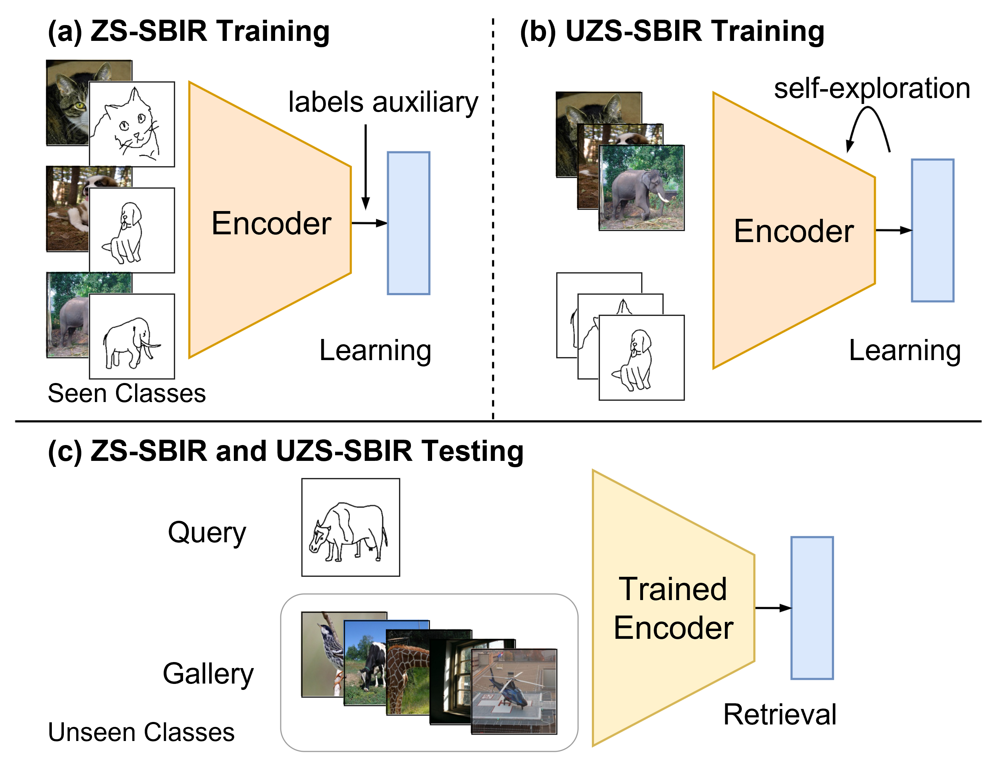

# Asymmetric Mutual Alignment for Unsupervised Zero-Shot Sketch-Based Image Retrieval
This repository provides a PyTorch implementation of the method presented in the AAAI 2024 paper titled "Asymmetric Mutual Alignment for Unsupervised Zero-Shot Sketch-Based Image Retrieval" (AAAI 2024). 

## Introduction
In recent years, many methods have been developed for zero-shot sketch-based image retrieval (ZS-SBIR). However, challenges arise due to the lack of training data that matches the test distribution and the absence of labels. We address this with unsupervised zero-shot sketch-based image retrieval (UZS-SBIR), where training data is unlabeled and training/testing categories do not overlap. We propose a novel **asymmetric mutual alignment** method (AMA) that includes a self-distillation module and a cross-modality mutual alignment module. This approach extracts feature embeddings from unlabeled data and aligns them across image and sketch domains, enhancing feature representations and improving generalization to unseen classes.




## Get started
Clone this repository and create a virtual environment as the follows:

```bash
  conda create -n uzs-sbir python=3.7.13
  conda activate uzs-sbi
  conda install pytorch==1.12.0 torchvision==0.13.0 torchaudio==0.12.0 cudatoolkit=11.3 -c pytorch -c conda-forge
```


### Preparation

1. **Dataset**  
   Prepare your datasets and place them in the `./dataset` directory. The expected datasets are:
   - [Sketchy](https://sketchy.eye.gatech.edu/)
   - [TU-Berlin](https://cybertron.cg.tu-berlin.de/eitz/projects/classifysketch/)
   - [QuickDraw](https://github.com/googlecreativelab/quickdraw-dataset)

2. **Pre-trained Model**  
   Download the [pre-trained model](https://dl.fbaipublicfiles.com/dino/dino_vitbase16_pretrain/dino_vitbase16_pretrain_full_checkpoint.pth) and place it in the `./pretrained_dino` director.
   


### Run the Code
```bash
  python main.py --aug-plus -a vit_base --batch-size 32 --mlp --cos -d skecthy
```

## Citation
If you find this repository useful for your research, please use the following.
```bash
@inproceedings{yin2024asymmetric,
  title={Asymmetric mutual alignment for unsupervised zero-shot sketch-based image retrieval},
  author={Yin, Zhihui and Yan, Jiexi and Xu, Chenghao and Deng, Cheng},
  booktitle={Proceedings of the AAAI Conference on Artificial Intelligence},
  volume={38},
  number={15},
  pages={16504--16512},
  year={2024}
}
```

